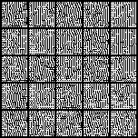

# Diffusion

An implementation of a Diffusion model in PyTorch, as described in '[Denoising Diffusion Probabilistic Models](https://arxiv.org/abs/2006.11239)'.

Demonstrations for MNIST and CIFAR10 can be run from main.py by changing the data_str argument appropriately. 

Note if adding new datasets, an appropriate padding argument must be given to the UNet model (height, width divisible by 32), e.g. for MNIST this is (2, 2, 2, 2) in order to pad the left, right, top and bottom of the image by 2 respectively, such that the images (originally 28x28) are now 32x32.

# Example

Running main.py on MNIST with batch_size=128, max_lr=2e-4, warmup_steps=4000 and epochs=50,

  

# References

**Denoising Diffusion Probabilistic Models:** https://arxiv.org/abs/2006.11239

**U-Net: Convolutional Networks for Biomedical Image Segmentation:** https://arxiv.org/abs/1505.04597
